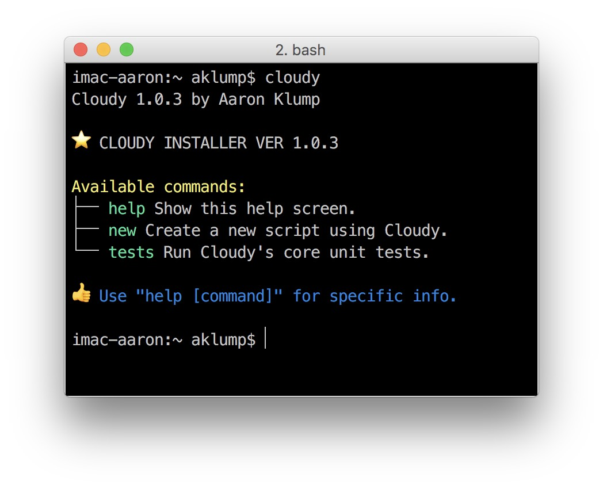

# Cloudy

## Summary

A lightweight BASH framework, which uses YAML or JSON for your script's configuration and provides a unit testing framework.

Cloudy Boosts the following features:

* Clean configuration options (YAML, JSON) for your scripts
* A BASH Unit Testing framework inspired by [PHPUnit](https://phpunit.de)
* Auto-generated help output

**Visit <https://aklump.github.io/cloudy> for full documentation.**

## Quick Start

After installing Cloudy, to write a new script called _thunder.sh_ ...

1. `cd` to the directory where you want the script to be created.
1. Type `cloudy new thunder.sh` and the necessary files/directories will be created in the current directory.
1. Open _thunder.sh_ and write your code.
1. Open _thunder.yml_ and add some configuration.
1. To learn about the options to use with `new` type `cloudy help new`.
1. Refer to [the documentation](https://aklump.github.io/cloudy/README.html) for to learn more.
 
### Using JSON

1. To work with JSON configuration instead type `cloudy new thunder.sh --json`.
 
## Requirements

* Works with BASH 3
* PHP (Used invisibly on the backend for configuration processing; no PHP knowledge is required to use Cloudy.)

## Contributing

If you find this project useful... please consider [making a donation](https://www.paypal.com/cgi-bin/webscr?cmd=_s-xclick&hosted_button_id=4E5KZHDQCEUV8&item_name=Gratitude%20for%20aklump%2Fcloudy).

## Installation

Installation means downloading this repository to your system.  It contains an installer program _cloudy_installer.sh_ as well as the cloudy framework.  You should use the installer tool to generate new cloudy scripts.

Here is a snippet to clone this repo to a directory on your system _$HOME/opt/cloudy_ and create a symlink in _$HOME/bin/cloudy_.  This assumes _~/bin_ is in your `$PATH` variable.

    (cd $HOME && (test -d opt || mkdir opt) && (test -d bin || mkdir bin) && cd opt && (test -d cloudy || git clone https://github.com/aklump/cloudy.git) && (test -s $HOME/bin/cloudy || ln -s $HOME/opt/cloudy/cloudy_installer.sh $HOME/bin/cloudy)) && cloudy

On success you should see:

## Usage

Beyond the [internal variables](https://www.tldp.org/LDP/abs/html/internalvariables.html#BASHSUBSHELLREF) the following variables are made available by Cloudy.

| varname | description |
|----------|----------|
| `$ROOT` | The directory containing your script. |
| `$SCRIPT` | Absolute path to your script.  |
| `$CONFIG` | Absolute path to the base config file. |
| `$WDIR` | The working directory when script was initiated. |
| `$LOGFILE` | Absolute path to a log file, if enabled. |

* Learn more about BASH with the [Advanced Bash-Scripting Guide](https://www.tldp.org/LDP/abs/html/).
* Determine your version of BASH with `echo $BASH_VERSION`
