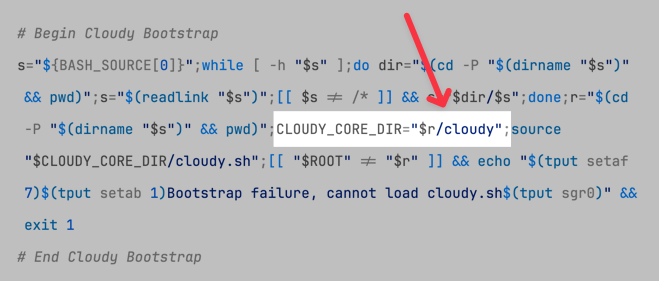

<!--
id: relocating_cloudy
tags: ''
-->

# Relocating Cloudy

To use an instance of the Cloudy framework other than the default, you need to do one thing; change the path value of `CLOUDY_CORE_DIR` in the bootstrap section of a Cloudy Package Controller:

