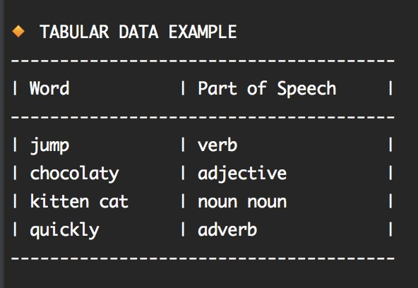

# Tables (Tabular Output)

You can easily create tables with _Cloudy_.

The following code:

    echo_headline "Tabular Data Example"
    table_set_header "Word" "Part of Speech"
    table_add_row "jump" "verb"
    table_add_row "chocolaty" "adjective"
    table_add_row "kitten cat" "noun noun"
    table_add_row "quickly" "adverb"
    echo_table
    
Will produce output like the following

## Control the Padding

Use the options `--lpad` and `--rpad` to control the horizontal padding.

        echo_headline "Tabular Data Example"
        table_set_header "Word" "Part of Speech"
        table_add_row "jump" "verb"
        ...
        echo_table --lpad=10 --rpad=10

