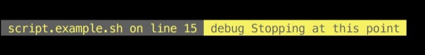
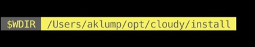
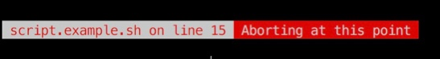

<!--
id: development
tags: usage
-->

# Development Tools

## How to use `debug`

This function has nothing to do with step debugging, however it gives you a consistent means to see where something happened and what a value is at a given point in the code

### Example One

    debug "Stopping at this point;$0;$FUNCNAME;$LINENO"

This will give you a nice output like this:

Or if called from within a function:

    function my_function() {
        debug "Stopping at this point;$0;$FUNCNAME;$LINENO"
    }

* Even if not calling within a function you may pass `$FUNCNAME` as shown in both cases, and it will simply be ignored if irrelevent.

### Example Two

This example shows how to create a label.  By separating your message and label with a single semi-colon, you will get this type of result.  Notice the `$` is escaped as we want a literal dollar-sign in the label.

     debug "$CLOUDY_START_DIR;\$CLOUDY_START_DIR"

### Example Three

This will just give you a quick message with default label:

    debug "Quick message"

## Stop execution with `throw`

Similar to `debug`, yet it stops execution immediately with an exit code of 3.

    throw "Aborting at this point;$0;$FUNCNAME;$LINENO"
    

